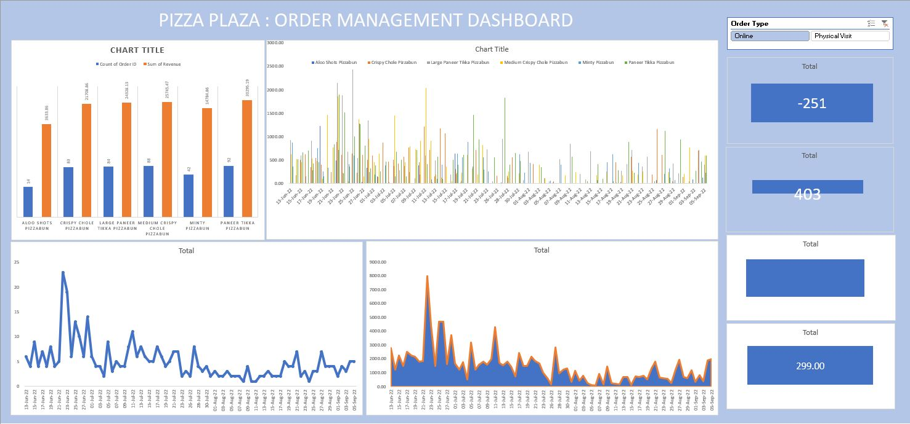

# Pizza Plaza Excel Analysis

Welcome to the Pizza Plaza Excel Analysis repository! Pizza Plaza is a fictitious fast-casual pizza restaurant chain that serves delicious, customizable pizzas to pizza enthusiasts worldwide. This project analyzes Pizza Plaza's sales data using Excel to uncover key insights and trends that can help improve business operations and decision-making.

---

## Dashboard

The analysis is accompanied by a visually appealing and interactive dashboard. The dashboard provides an overview of key performance indicators (KPIs) and visualizations, making it easy to understand the business metrics. 

---

### Dashboard Preview


---

## Business Questions Solved

This repository focuses on answering the following key business questions:

1. **Total Orders**: How many orders were placed during the analysis period?
2. **Total Revenue**: What is the total revenue generated by Pizza Plaza?
3. **Average Revenue**: What is the average revenue per order?
4. **Average Discount Given**: What is the average discount applied to orders?
5. **Most Ordered Products**: Which products were ordered the most by customers?
6. **Trend of Number of Sales for Each Day**: How does the number of sales vary on a daily basis?
7. **Trend of Revenue Generated for Each Day**: What is the daily trend of revenue generated?
8. **Trend of Revenue Generated for Each Product**: How does revenue generation vary across different products?
9. **Multiple Views for Online and Offline Orders (Using Slicers)**: How do sales metrics differ between online and offline orders using slicers for interactive analysis?


By addressing these questions, this analysis provides actionable insights into Pizza Plaza's sales performance and helps identify areas for growth and improvement.

---

## How to Use This Repository

1. Clone the repository to your local machine:
   ```bash
   git clone https://github.com/AyushAi/Pizza-Plaza.git
   ```
2. Open the Excel file in your preferred spreadsheet software.
3. Explore the analysis and insights, and refer to the dashboard image for visual representations of key metrics.

---

## Folder Structure

```
Pizza-Plaza-Excel-Analysis/
├── Data/
│   ├── sales_data.xlsx
├── Image/
│   ├── Dashboard.JPG
├── README.md
```

---

## License

This project is licensed under the MIT License. Feel free to use, modify, and share it as needed.

---

## Acknowledgments

Special thanks to the fictitious Pizza Plaza for providing the inspiration for this project.
